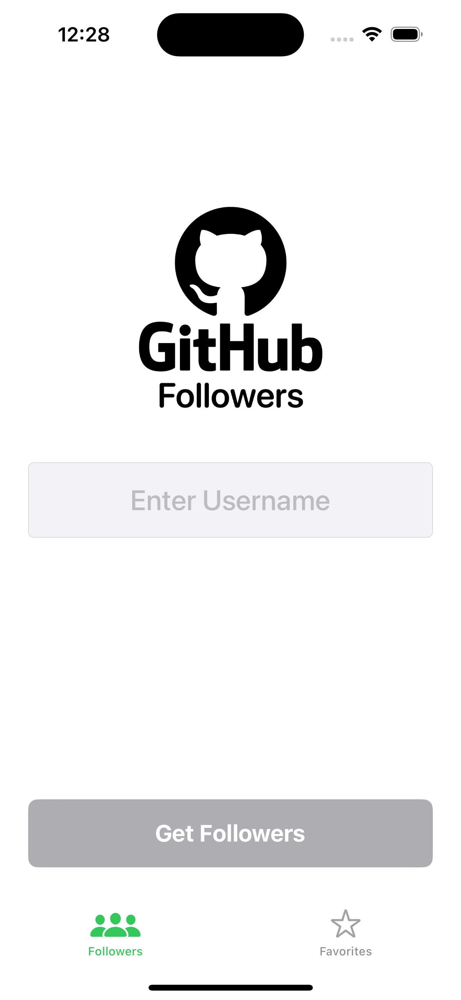
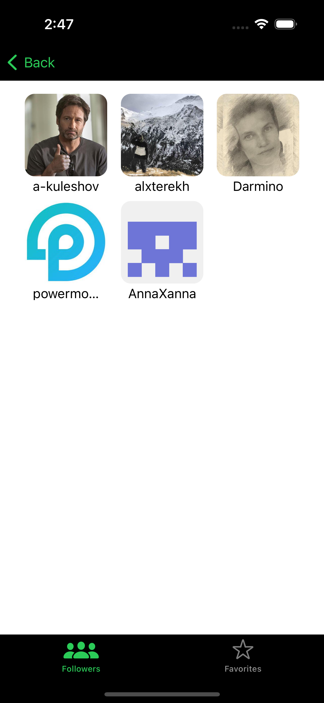

# GitHubFollowers

Example take-home project job interview for my mentee or self-study.
I published the design on [Figma Community](https://figma.com/@aifedorov).

## Frameworks/Technologies
The project consists of two projects: `UIKit` and `SwiftUI` versions.
1) A GitHubFollowers iOS app written in `Swift` using `MVP` architectural pattern.
- [x] 100% programmatic UI using `UIKit` and `NSLayoutAnchor`.
- [x] No 3rd party libraries.
- [x] iOS 14.0 or higher.
- [x] Custom design for `UITabBar` and `UINavigationBar`.
- [x] `UITextField` with validation using `NSPredicate`.
- [x] `UICollectionView` and `UITableView` with `Diffable Data Source`.
- [x] `UISearchController` for searching users in the followers list.
- [x] `Swift Concurrency (async/await)` for the network.
- [x] Using `Codable` for encoding and decoding `JSON`.
- [x] Error handling and displaying user fullscreen or alert.
- [x] Caching image using `NSCache`.
- [ ] Caching favorites in `Core Data`.
- [ ] Supporting Pagination.
- [ ] Supporting Dark Mode.
- [ ] Supporting iPhone SE (fix collection view and add scroll view for Profile Screen)

1) A GitHubFollowers iOS app written using `SwiftUI` and `MVVM` architecture.
- [x] iOS 15.0 or higher.
- [x] No 3rd party libraries.
- [x] `Combine` и `Swift Concurrency (async/await)`.
- [x] Caching image using `NSCache`.
- [x] Using `Codable` for encoding and decoding `JSON`.
- [ ] Error handling and displaying user alert.
- [ ] Caching favorites in `Core Data`.
- [ ] Supporting Pagination.
- [ ] Supporting Dark Mode.
- [ ] Unit tests.
- [ ] UI tests.

**Info:** Using `Core Data` for this project is overwhelming. Using a cache on a disk is enough. I use it for studying purposes.

## Getting Started

1. `git clone https://github.com/aifedorov/GitHubFollowers.git`.
2. `cd GitHubFollowers`.
3. Open `GitHubFollowers.GitHubFollowers.xcworkspace` in Xcode 15.0 or higher and choose UIKit or SwiftUI version xcodeproject.

## Screenshots

## Contributing

Please feel free to help out with this project! If you see something that could be made better or want a new feature, open up an issue or send a Pull Request! I don't plan on putting this out on the App Store, but it's a great learning resource for those interested in iOS development.

## Reach me

If you want to study iOS development or need help with a job interview, write to me.
[Getmentor](https://getmentor.dev/mentor/aleksandr-fedorov-1631) 
[LinkedIn](https://www.linkedin.com/in/alexandr-fedorov/)

## License
[MIT](LICENSE)