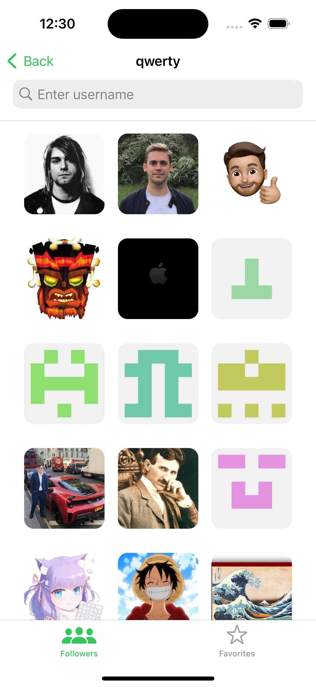

# GitHubFollowers

Example take-home project job interview for my mentee or self-study.
I published the design on [Figma Community](figma.com/@aifedorov).
A GitHubFollowers iOS app written in `Swift` using `MVP` architectural pattern.

- 100% programmatic UI using `UIKit` and `NSLayoutAnchor`
- No 3rd party libraries
- iOS 14.0 or higher

## Features

- [x] Custom design for `Tab bar` and `Navigation Bar`
- [x] `UITextField` with validation using `NSPredicate`
- [x] `UICollectionView` with `Diffable Data Source` and `refresh control`
- [ ] `UITableView` with `Diffable Data Source`
- [x] `Swift Concurrency (async/await)` for network
- [x] Using `Codable` for encoding and decoding `JSON`
- [x] Error handling and display for user
- [x] Caching image using `NSCache`
- [ ] Caching `JSON` data on disk
- [ ] Support Dark Mode
- [ ] Observing internet connection

## Getting Started

1. `git clone https://github.com/aifedorov/GitHubFollowers.git`
2. `cd GitHubFollowers`
3. Open `GitHubFollowers.xcodeproj` in Xcode 14.0 or higher

## Screenshots

## Contributing

Please feel free to help out with this project! If you see something that could be made better or want a new feature, open up an issue or send a Pull Request! I don't really plan on putting this out on the App Store, but I think it's a great learning resource for those interested in iOS development.

## License
[MIT](LICENSE)